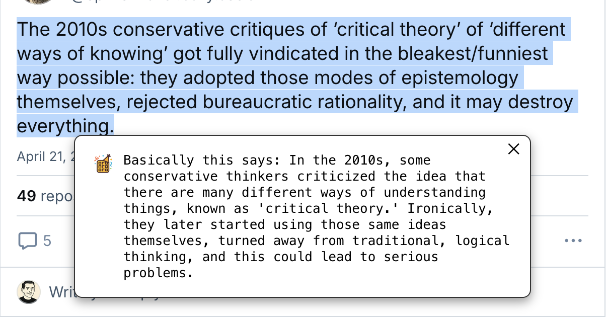

# Milchick


A **one‑click explainer.** People on social media love to speak in [unnecessarily complex language](https://severance-tv.fandom.com/wiki/Trojan%27s_Horse). Select any text in Firefox, right‑click, and choose **“Too many big words”**. The add‑on sends the snippet to OpenAI's GPT API and pops up a tidy, in‑page modal with a plain‑language explanation.



## ✨ Features

* **Context‑menu action** appears only when text is selected.
* **OpenAI Chat‑Completions** request powered by GPT‑4o‑mini by default (you can change the model).
* **Lightweight modal UI** injected on demand—no persistent DOM pollution.
* **Manifest V3‑ready** background script; works on current Firefox and future‑proofed for MV3 rollout.
* **Options page** lets you store your OpenAI API key securely via `browser.storage.sync`.

## 📦 Installation

### Temporary/test

1. Clone or download this repository.
2. In Firefox, open `about:debugging#addons`.
3. Click **This Firefox** → `Load Temporary Add‑on…`.
4. Select the repo’s **`manifest.json`** file.
5. The extension appears in the list; click **Options** to paste your OpenAI API key.

**Heads‑up:** Temporary add‑ons disappear when you close Firefox; use the *Package install* guide below for daily use.

### Package install (unsigned XPI)

Only available in Firefox Dev or Nightly:

First, open `about:config` and set `xpinstall.signatures.required` → **false**

Then, package:

```bash
zip -r milchick.xpi \
    manifest.json background.js content.js options.html options.js waffle-party.png
```
Then open `about:addons`, click the ⚙️ menu → **Install Add‑on From File…**, and pick `milchick.xpi`.

## 🛠 Usage

1. Highlight any text on any webpage.
2. Right‑click → **Too many big words**.
3. A small modal appears with the explanation.
4. Click ✕ or press *Esc* to dismiss.

## ❗ Validate every answer ❗

Milchick relies on OpenAI’s large-language-model API. While the model is remarkably good at plain-language summaries, it can still:

* omit nuance or context,
* add plausible-sounding but incorrect details,
* or misinterpret the author’s intent.

**Always treat the popup as a draft, not an authoritative source.**  
If fidelity matters, read the original text yourself and verify any critical claims before sharing or acting on them.

## License

All code is provided under the [BSD 3-Clause license](https://github.com/hodgesmr/milchick/blob/main/LICENSE).
